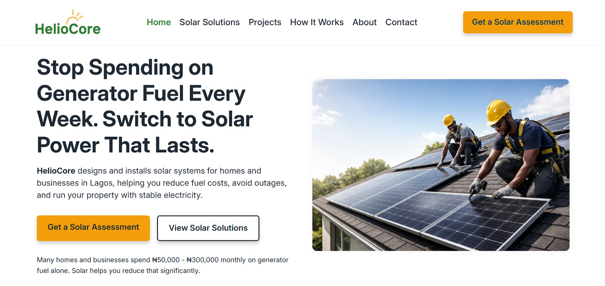
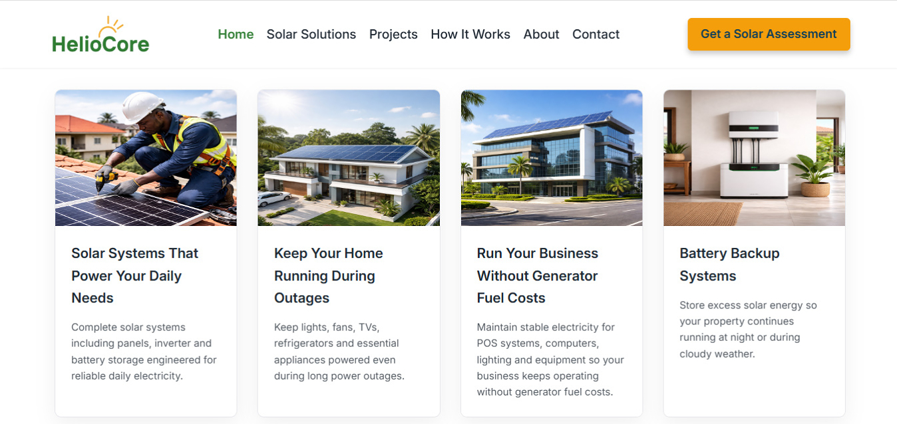

# HelioCore – Solar Energy Website

HelioCore is a conversion-focused website concept designed for solar energy businesses in Lagos.  
The goal is not just to present services, but to structure content in a way that turns visitors into enquiries.

## 📸 Screenshots:

### HelioCore website Hero section

### HelioCore website Services section

## 🌐 Live Demo

[View the live site](https://heliocore.vercel.app)

## Overview

Many solar company websites focus on generic messaging like:

- “Reliable solar solutions”
- “Affordable installation”

But potential customers are thinking:

- How do I reduce my generator fuel cost?
- Can solar power my home or business reliably?

HelioCore demonstrates a better approach:

**Clear problem → Clear solution → Clear next step**

## Typical Website vs HelioCore Approach

**Typical Solar Website**
- Generic claims
- No clear problem framing
- Weak call-to-action

**HelioCore Approach**
- Starts with real customer pain (fuel cost)
- Explains solution clearly (solar system)
- Guides user to a clear next step (assessment)

## Key Focus Areas

### Conversion-Driven Structure
- Problem-first messaging (generator cost pain point)
- Clear value proposition in the hero section
- Strong and repeated call-to-action: *Get a Solar Assessment*

### SEO Optimization
- Location-based targeting (Lagos)
- Semantic HTML structure
- Optimized meta tags (Open Graph, Twitter)
- Keyword-focused headings and content

### User Experience (UX)
- Clean and structured layout
- Easy navigation across sections
- Mobile-responsive design
- Accessible form inputs and labels

### Performance
- Optimized `.webp` images
- Lazy loading for non-critical images
- Preloaded hero image
- Lightweight CSS and JavaScript

## Features

- Strong hero section with clear messaging  
- Problem vs Solution comparison (Generator vs Solar)  
- Solar services breakdown (home, commercial, battery systems)  
- Project showcase with results  
- Testimonials for trust building  
- FAQ section addressing common concerns  
- Conversion-focused contact form  
- Multiple call-to-action placements  

## Tech Stack

- HTML5  
- CSS3  
- JavaScript  
- AOS (Animate On Scroll)   

## What This Project Demonstrates

- Structuring websites around **user intent**, not just visuals  
- Combining **SEO + UX + conversion principles**  
- Building fast, accessible, and action-focused interfaces  

## Key Insight

Most business websites don’t have a traffic problem.

They have a **conversion problem**.

This project shows how improving structure and messaging can directly impact enquiries.

## 👤 Author:

**Chijioke Nwabasili**
- Portfolio: [chijiokenwabasili.vercel.app](https://chijiokenwabasili.vercel.app)

